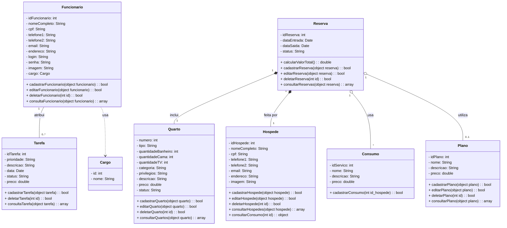

### Diagrama de classe

```mermaid
classDiagram

class Funcionario {
  - idFuncionario: int
  - nomeCompleto: String
  - cpf: String
  - telefone1: String
  - telefone2: String
  - email: String
  - endereco: String
  - login: String
  - senha: String
  - imagem: String
  - cargo: Cargo
  + cadastrarFuncionario(object funcionario): bool
  + editarFuncionario(object funcionario): bool
  + deletarFuncionario(int id): bool
  + consultaFuncionario(object funcionario): array
}

class Cargo {
  - id: int
  - nome: String
}

class Hospede {
  - idHospede: int
  - nomeCompleto: String
  - cpf: String
  - telefone1: String
  - telefone2: String
  - email: String
  - endereco: String
  - imagem: String
  + cadastrarHospede(object hospede): bool
  + editarHospede(object hospede): bool
  + deletarHospede(int id): bool
  + consultarHospedes(object hospede): array
  + consultarConsumo(int id): object
}

class Quarto {
  - numero: int
  - tipo: String
  - quantidadeBanheiro: int
  - quantidadeCama: int
  - quantidadeTV: int
  - categoria: String
  - privilegios: String
  - descricao: String
  - preco: double
  - status: String
  + cadastrarQuarto(object quarto): bool
  + editarQuarto(object quarto): bool
  + deletarQuarto(int id): bool
  + consultarQuartos(object quarto): array
}

class Reserva {
  - idReserva: int
  - dataEntrada: Date
  - dataSaida: Date
  - status: String
  + calcularValorTotal(): double
  + cadastrarReserva(object reserva): bool
  + editarReserva(object reserva): bool
  + deletarReserva(int id): bool
  + consultarReservas(object reserva): array
}

class Consumo {
  - idServico: int
  - nome: String
  - descricao: String
  - preco: double
  + cadastrarConsumo(int id_hospede): bool
}

class Tarefa {
  - idTarefa: int
  - prioridade: String
  - descricao: String
  - data: Date
  - status: String
  - preco: double
  + cadastrarTarefa(object tarefa): bool
  + deletarTarefa(int id): bool
  + consultaTarefa(object tarefa): array
}

class Plano {
  - idPlano: int
  - nome: String
  - descricao: String
  - preco: double
  + cadastrarPlano(object plano): bool
  + editarPlano(object plano): bool
  + deletarPlano(int id): bool
  + consultarPlano(object plano): array
}

Funcionario "1" -- "0..*" Tarefa : atribui
Reserva "1" *-- "1" Quarto : inclui
Reserva "1" *-- "1" Hospede : feita por
Reserva "1" o-- "*" Consumo : usa
Reserva "1" o-- "0..1" Plano : utiliza
Funcionario ..> Cargo : usa
```