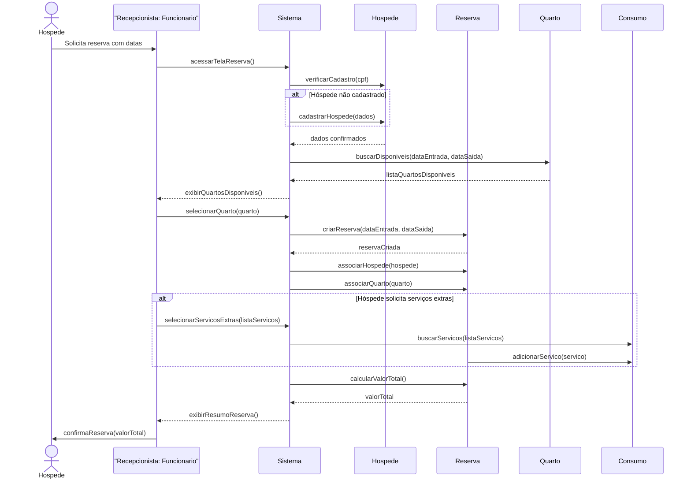

### Diagrama de sequência

```mermaid
sequenceDiagram

    actor Hospede
    participant Recepcionista as "Recepcionista: Funcionario"
    participant Sistema
    participant HospedeObj as Hospede
    participant Reserva
    participant Quarto
    participant Consumo

    %% Início da reserva
    Hospede ->> Recepcionista: Solicita reserva com datas
    Recepcionista ->> Sistema: acessarTelaReserva()

    %% Cadastro ou verificação do hóspede
    Sistema ->> HospedeObj: verificarCadastro(cpf)
    alt Hóspede não cadastrado
        Sistema ->> HospedeObj: cadastrarHospede(dados)
    end
    HospedeObj -->> Sistema: dados confirmados

    %% Verificação de quarto
    Sistema ->> Quarto: buscarDisponiveis(dataEntrada, dataSaida)
    Quarto -->> Sistema: listaQuartosDisponiveis
    Sistema -->> Recepcionista: exibirQuartosDisponiveis()
    Recepcionista ->> Sistema: selecionarQuarto(quarto)

    %% Criação da reserva
    Sistema ->> Reserva: criarReserva(dataEntrada, dataSaida)
    Reserva -->> Sistema: reservaCriada
    Sistema ->> Reserva: associarHospede(hospede)
    Sistema ->> Reserva: associarQuarto(quarto)

    %% Serviços Extras (opcional)
    alt Hóspede solicita serviços extras
        Recepcionista ->> Sistema: selecionarServicosExtras(listaServicos)
        Sistema ->> Consumo: buscarServicos(listaServicos)
        Reserva ->> Consumo: adicionarServico(servico)
    end

    %% Finalização
    Sistema ->> Reserva: calcularValorTotal()
    Reserva -->> Sistema: valorTotal
    Sistema -->> Recepcionista: exibirResumoReserva()
    Recepcionista ->> Hospede: confirmaReserva(valorTotal)
```