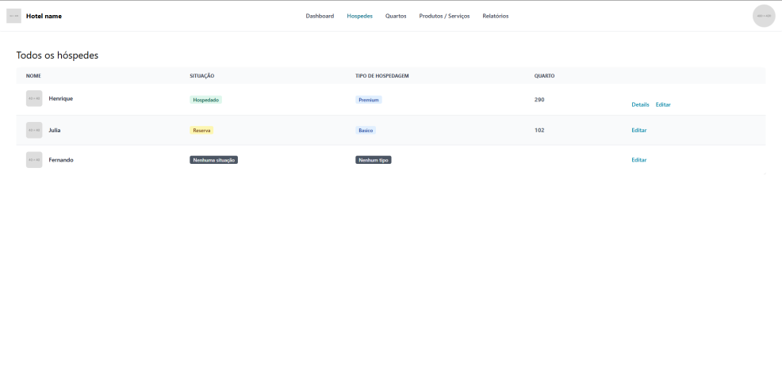
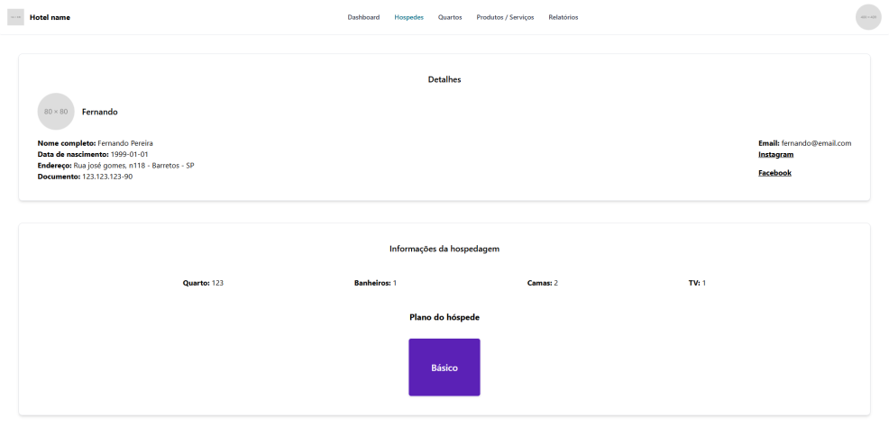
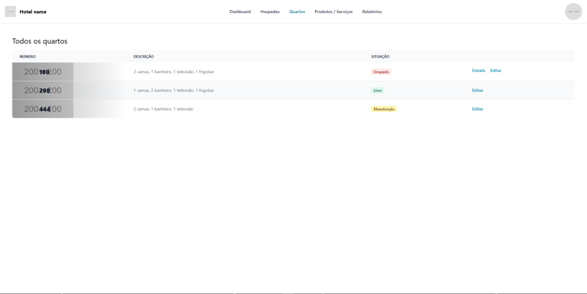
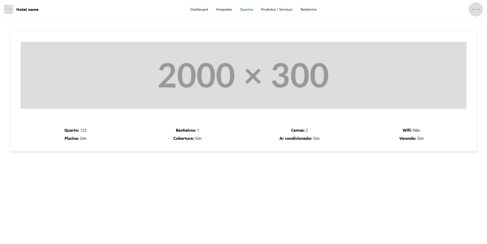
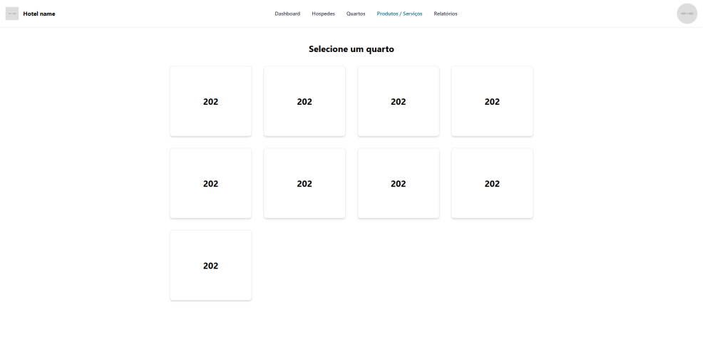
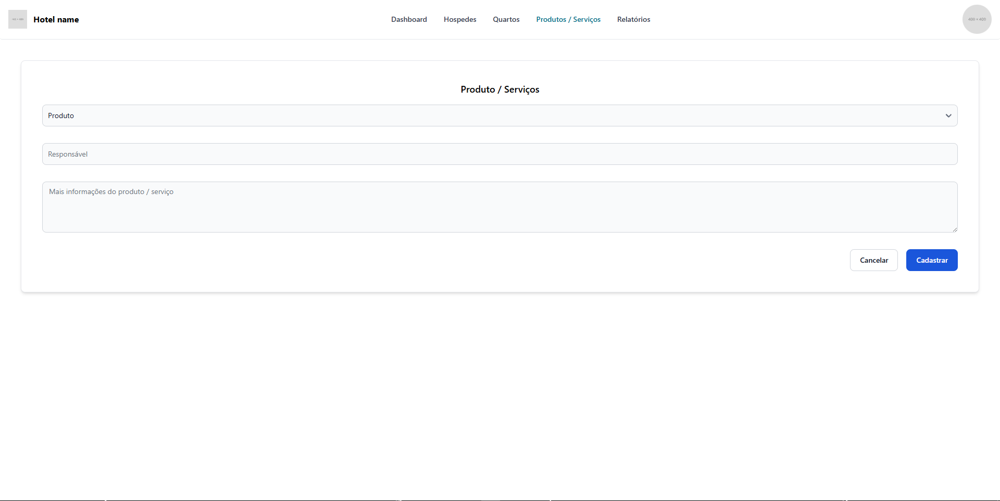
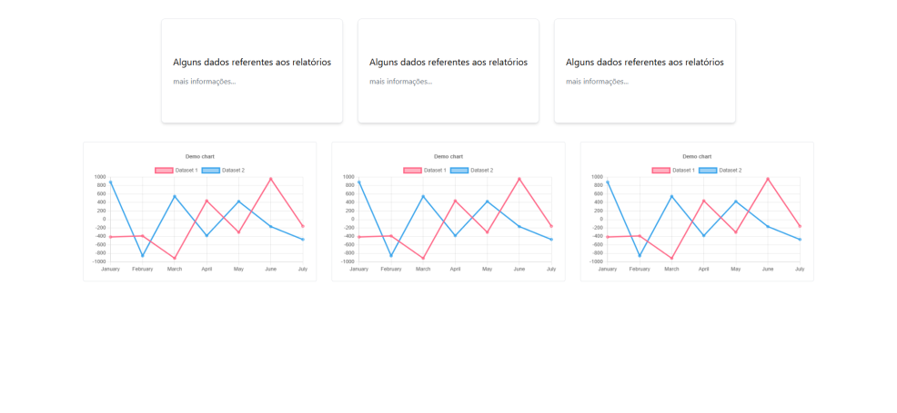

# Orçamento

### Dados do cliente

Nome: José Ribeiro

CPF: 902.849.765-19

Endereço: Rua do seu João, 559 - Barretos - SP

Telefone: (17) 98841-8902

E-mail: joseribeiro_1999@gmail.com

### Arquitetura do sistema

O software será construído usando a Arquitetura MVC (Model View Controller)

O software utlizará as seguintes tecnologias:
- NextJS
- TailwindCSS / FlowBite React
- MySQL

Local onde o software será hospedado (conforme necessidades do cliente):
- AWS (Instância do software e banco de dados)

### Esboço de telas

As telas listadas neste orçamento são as quais o cliente poderá ajudar na personalização, conforme sua preferência, páginas como: Gerenciamento de usuário, Cadastro de quartos, Cadastro de serviços entre outros não serão totalmente personalizados pelo cliente e terão um layout conforme o padrão do sistema.

Todas as informações e dados contidos nas imagens são meramente ilustrativos e deverão ser removidos na versão final do software para população de dados reais conforme necessidade do cliente.

#### Dashboard

#### Hóspedes

#### Hóspede detalhes

#### Quartos

#### Quarto detalhes

#### Produtos

#### Produto cadastro

#### Relatórios

### Quantidade de horas investidas pela equipe

- Semanal: 7h
- Mensal: 28h
- Total de 6 meses: 168h

Cada membro da equipe trabalhará 168h totais neste projeto

### Prazo de entrega

O projeto completo será entregue na data 17/06/2025

### Custo ao cliente

O cliente pagará R$ 30.000 no sistema completo
